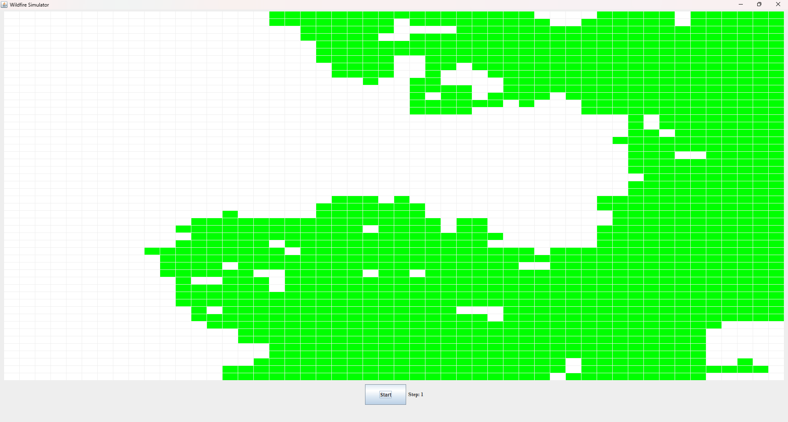
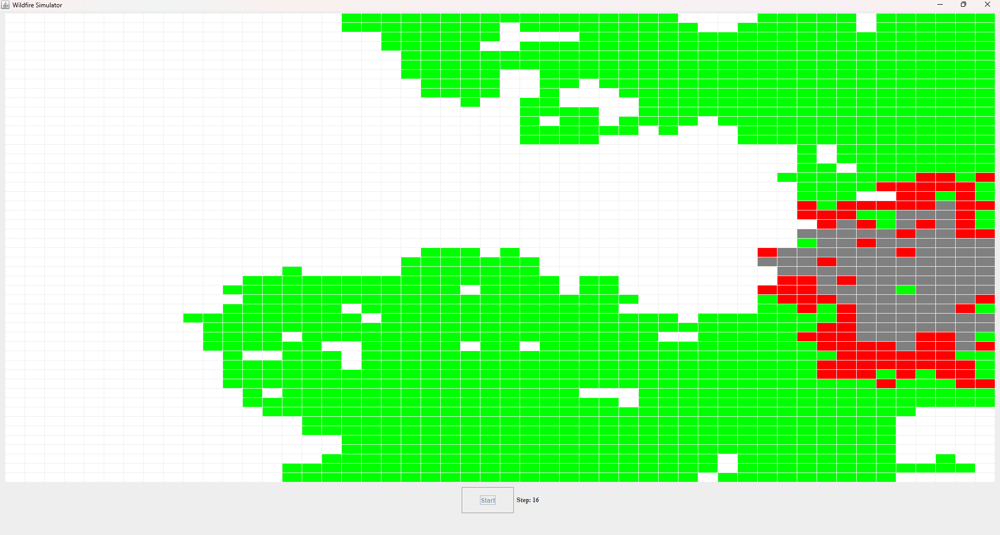

# Wildfire Simulator

A Java-based wildfire spread simulation built on a cellular automaton model. The forest is represented as a grid of cells; fire ignites at a set point and spreads to neighbouring trees each step based on a configurable probability. Watch the fire front advance in real time through a simple GUI.

## Screenshots

### Initial state — forest before ignition


### Step 16 — fire spreading, burnt cells visible


## 🔬 How it works

Each cell on the grid is in one of three states:

| State | Colour | Meaning |
|-------|--------|---------|
| Tree | 🟩 Green | Healthy, can catch fire |
| Burning | 🟥 Red | Currently on fire, spreads to neighbours |
| Burnt | ⬜ Grey | Burned out, no longer spreads |

At each step, every burning cell attempts to ignite each of its neighbouring tree cells with a fixed probability. The simulation advances step by step until no burning cells remain.

## ⚙️ Configuration

Parameters are set in `instructions.txt` before running:

```
50 50      ← grid width and height
1          ← ignition point
0.3        ← fire spread probability (0.0 – 1.0)
5          ← number of steps to run
```

## ▶️ Running it

Open the project in **IntelliJ IDEA**, let Maven sync dependencies, then run the main class from `src/main`. Click **Start** in the GUI to begin the simulation.


